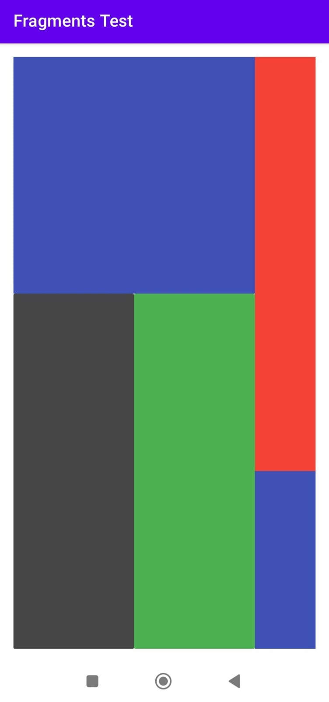

# Fragments Test Sample

## We are going to create the below screen where the assigned width and height will be responsive to the any screen using the linear layout and the weight attribute

### I didn't use fragments really, you can use any component you want in the nested linear layout we created

### I just said fragments since it's common to use them in different parts of the screen activity

